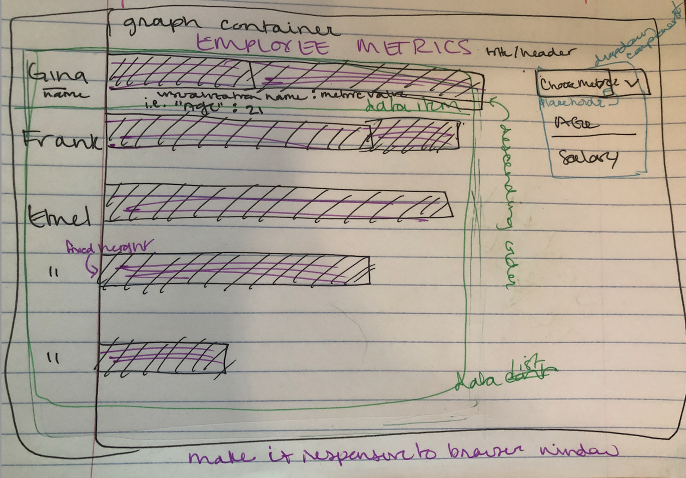

# Documentation for SEI Novus FE Coding Assessment

## Written by [Rachel Donahue](https://www.linkedin.com/in/rachelmdonahue/)

### Assumptions

I have outlined my understanding of the requirements in a wire frame, shown below.

### Limitations

This project is written in vanilla Javascript only.  I had issues getting the bar chart oriented horizontally.

I ran out of time to implement a dropdown to choose between age and salary metrics (task 7).

---

## Instructions / Requirements

### Simple Horizontal Bar Chart

Using HTML, CSS and JavaScript, write the code necessary to generate a horizontal bar chart, where the bar heights are fixed and the widths are variable.

Build a web application with the following features:

1. When loaded, it draws a horizontal bar chart that graphs one of the metrics in the dataset (age or salary).
2. Show the name next to each bar and the value of the metric.
3. The scale that you use is not important, as long as we are able to see differences in bar length relative to the metric value.
4. Choose a reasonable height for each bar, which can be fixed.
5. The bar chart should resize when you resize the browser window.
6. Sort the bars in descending order (the longest bar is on the top).
7. Provide a dropdown with the options 'Age' and 'Salary'. When the dropdown is changed, the chart is plotted again with the selected metric.

You are allowed to use jQuery as a third-party library. No other third-party libraries are allowed.

The application should run in a web browser. Send the code in a ZIP file along with instructions on how to run the app.

### Time to Complete

4 hrs.

### Implementation Instructions

1. Clone this Github repo and `cd` into the project's directory.

1. To run this app in the browser, right-click on the `index.html` file and select `open with live server`.
